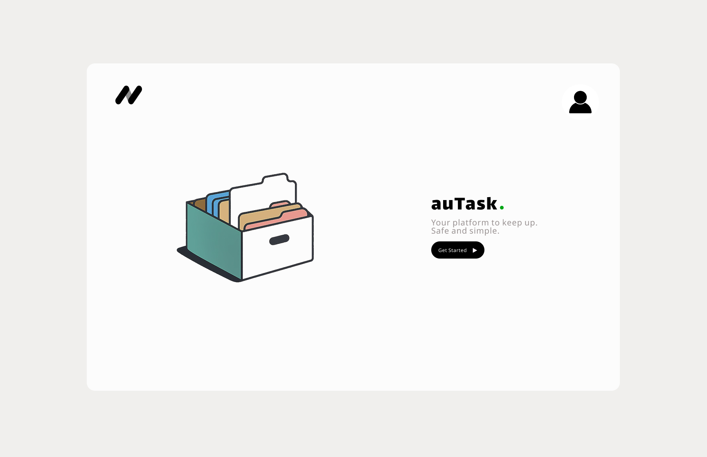
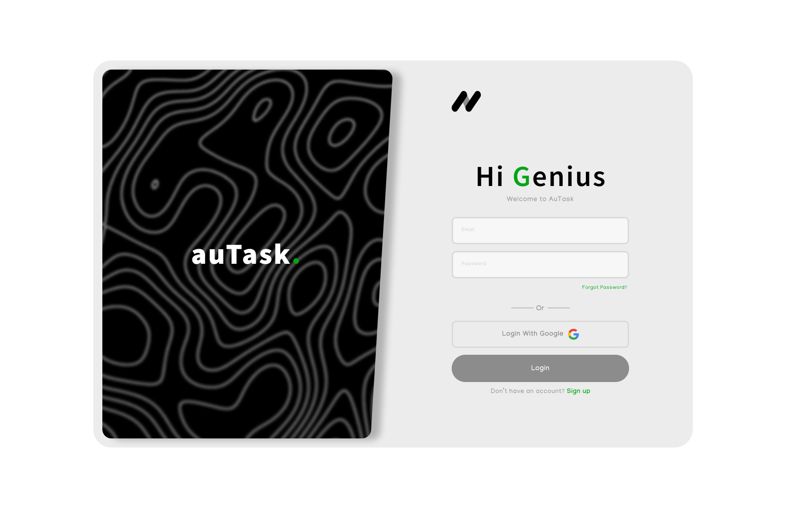
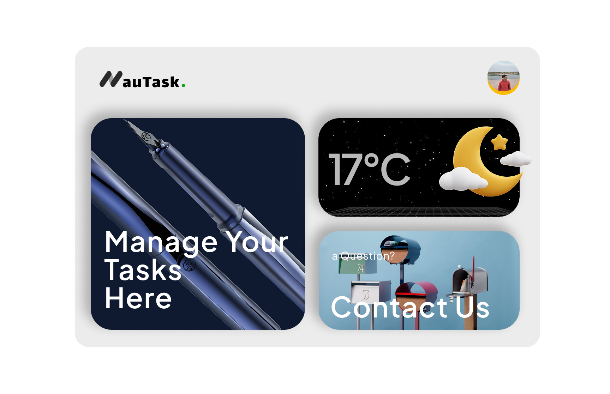
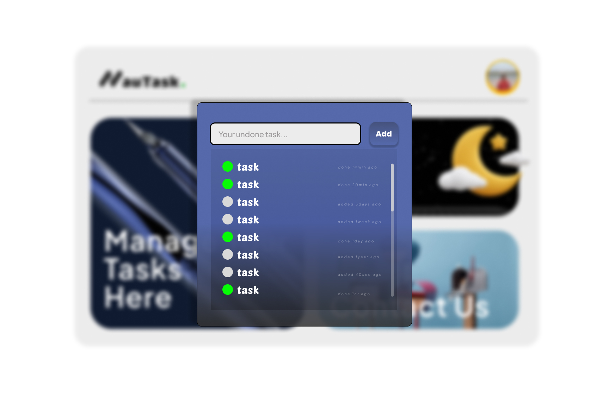
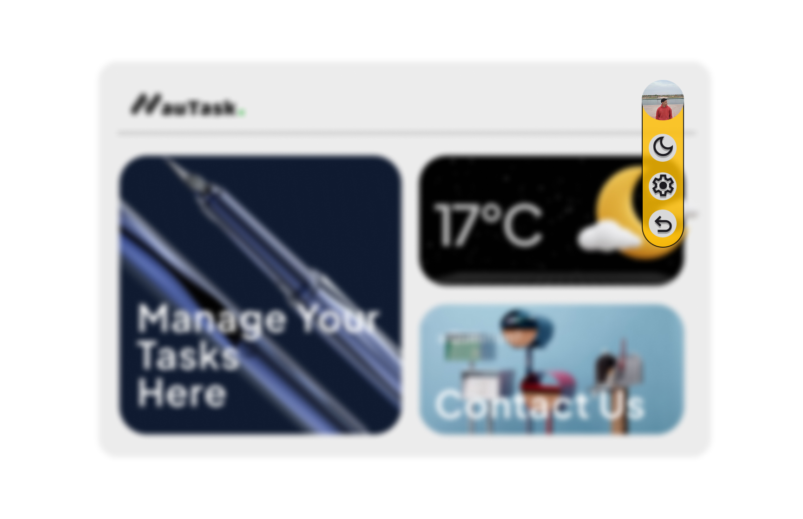
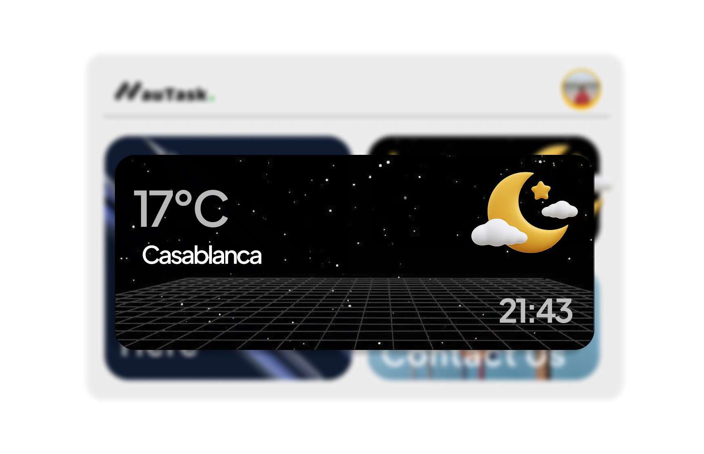

# auTask 📝🌤️

**auTask** is a modern, minimalist task management web app built with **React** and **TypeScript**. It helps users stay productive by tracking their tasks and showing local weather conditions — all in one clean interface.

---

## ✨ Features

- 🔐 **Authentication**
  - Sign in with **email and password** or via **Google OAuth**.

- ✅ **Task Management**
  - Add new tasks with timestamps.
  - Mark tasks as done/undone.
  - Track when tasks were created and completed.

- 🌦️ **Live Weather & Location**
  - Fetches current **weather data** and **user location** using public APIs.
  - Weather info is shown directly on the home page.

---

## 🛠️ Tech Stack

- **Frontend:** React (TypeScript)
- **Auth:** Firebase Auth / Auth0
- **API Integration:** OpenWeatherMap, Geolocation API
- **State Management:** React Context / Zustand / Redux
- **Styling:** Tailwind CSS / Styled Components
- **Design:** [Figma](https://www.figma.com/) (original, by me)

---

## 🎨 UI & Design

The UI/UX design of auTask is **original and created by me in Figma**. Below are some previews:

| Landing Page | Login Page | Sign Up Page |
|--------------|------------|--------------|
|  |  |  |

| Home Page | Tasks page | User tools |
|-----------|------------|------------|
|  |  |  |

| Location, Weather and Time |
|----------------------------|
|  |

---

## 🚀 Getting Started

```bash
git clone https://github.com/your-username/auTask.git
cd auTask
npm install
npm run dev